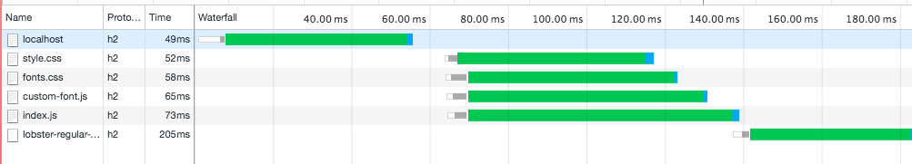
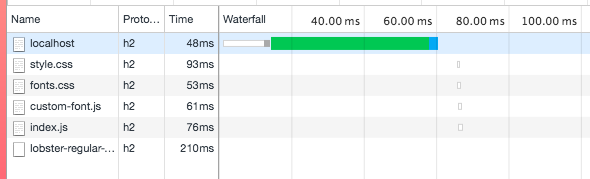
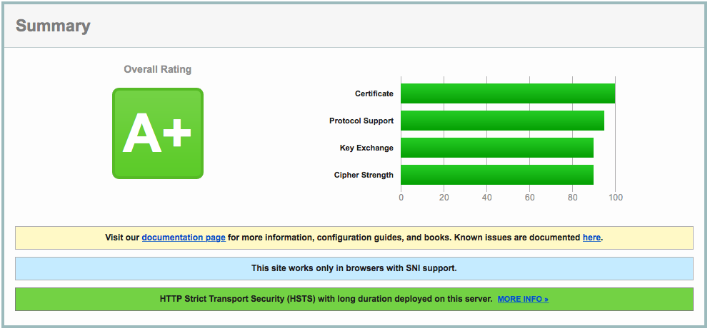
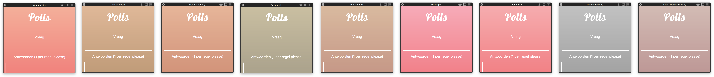
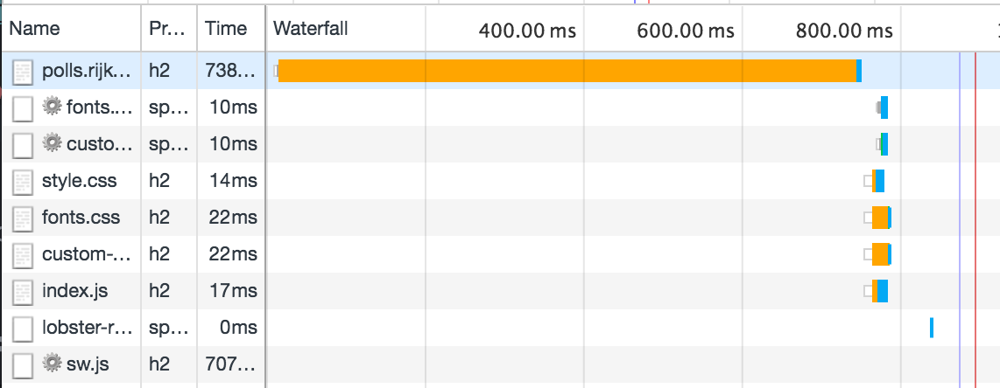

<h1 align="center">
	
	<br>
	<br>
</h1>

<p align="center">
	<b>✨ Live polling tool @ <a href="https://polls.rijks.website">polls.rijks.website</a> ✨</b>
</p>

<br>

[](https://semaphoreci.com/rijkvanzanten/polls)

## What
Polls is a simple web-based tool which lets you create a poll to a share-able link. It allows other users to view and vote on the poll and see the results in real-time.

The app was built using some of the latest (and greatest) in web technology while also keeping the best practices of progressive enhancement in mind.

## Features
### http2 & Server push
http/2 allows the client to request and download all assets in parallel, which greatly improves load speeds. Server Push allows the server to push extra files to the browser on initial request. This comes in quite handy for files like the stylesheet and main JS file.

*Without server push*


*Without server push*


_Nginx doesn't support http/2 between proxies and upstreams. The effects of this won't be visible on the live site._

#### Support (94.19%)
_Not including streaming, couldn't find support stats for that one_
-  [x] IE (11+)
-  [x] Edge (12+)
-  [x] Firefox (36+)
-  [x] Chrome (41+)
-  [x] Safari (9+)
-  [x] Opera (28+)
-  [x] iOS Safari (9.2)
-  [ ] Opera Mini
-  [x] Android Browser (56+)
-  [x] Chrome for Android (57+)

#### Fallback
The server will automatically serve files over http/1.1 when http/2 isn't supported. The speed optimizations for http2 will result in a big performance hit on browser which don't support it. The big speed improvements for the large majority outweigh the performance issues on older browsers.

### https
The app is being served over http/2 with a https certificate by Let's Encrypt and a improved Diffie Hellman group. This results in a very strong encryption.

  
[SSL Report results by SSL Labs](https://www.ssllabs.com/ssltest/analyze.html?d=polls.rijks.website)

See [my research on this](https://github.com/rijkvanzanten/misofome/wiki/Rijks-POC) for more information.

#### Support (100%)
_This is specifically for my live [lets encrypt certificate](https://community.letsencrypt.org/t/which-browsers-and-operating-systems-support-lets-encrypt/4394)_
-  [x] IE (XP SP3+)
-  [x] Edge
-  [x] Firefox (2+)
-  [x] Chrome
-  [x] Safari (4+)
-  [x] Opera
-  [x] iOS Safari (3.1+)
-  [x] Opera Mini
-  [x] Android Browser (2.3.6+)
-  [x] Chrome for Android

_All browser support at least the now deprecated SSL spec. Most modern browser use TLS_

#### Fallback
None. The site should and will be secure. There is no real reason to provide an unsecure version when the browser support is this great.


### WebSockets
> HTML5 WebSocket represents the first major upgrade in the history of web communications. Before WebSocket, all communication between web clients and servers relied only on HTTP. Now, dynamic data can flow freely over WebSocket connections that are persistent (always on), full duplex (simultaneously bi-directional) and blazingly fast.
— [Kaazing](https://kaazing.com/websocket/)

WebSockets allow the application to update the poll results in real-time across all clients which are connected to the website.

#### Support (98.02%)
-  [x] IE (10+)
-  [x] Edge (12+)
-  [x] Firefox (11+)
-  [x] Chrome (16+)
-  [x] Safari (5+)
-  [x] Opera (11.5+)
-  [x] iOS Safari (4.3+)
-  [ ] Opera Mini
-  [x] Android Browser (4.4+)
-  [x] Chrome for Android (57+)

#### Fallback
Polls implements the WebSocket protocol by using [`socket.io`](http://socket.io). Socket.io automagically switches between the older and current implementation of WebSockets or falls back to XHR when WebSockets aren't supported at all.  
When `socket.io` fails or JS fails completely, the app still allows the user to create and vote on polls with regular `post` and `get` requests.

### Virtual DOM
Updating the DOM when a vote comes through via socket is being handled by creating a new virtual representation (vdom) of the DOM and checking the differences with the previous vdom. These differences are then patched into the real DOM. This operation is way faster than inserting a newly rendered HTML string into the DOM.

#### Support (approx. 99.75%)
Virtual DOM isn't a browser API or new technique so it should technically run on all devices which run JavaScript. I assume Opera Mini won't run the JS, so that's why the support isn't a 100%.

#### Fallback
The virtual-dom rendering is also used on the server-side. When client-side JS fails or won't start at all, it will gracefully fall back to the server pre-rendered HTML. I won't update automatically anymore though, but new results can still be viewed by refreshing the page manually.

### ServiceWorker
A service worker is a script that the browser runs in the background, separate from a web page. This is very exiting, because it allows developers to create webpages which support offline experiences.

#### Support (59.58%)
-  [ ] IE
-  [ ] Edge
-  [x] Firefox (44+) (Partial)
-  [x] Chrome (40+) (Partial)
-  [ ] Safari
-  [x] Opera (27+) (Partial)
-  [ ] iOS Safari
-  [ ] Opera Mini
-  [x] Android Browser (56+) (Partial)
-  [x] Chrome for Android (57+) (Partial)

#### Fallback
As long as you don't rely on the ServiceWorker for the inner workings of your app, you'll be fine. ServiceWorkers work beautifully progressively enhanced on all browsers which support ServiceWorkers. It can be easily feature checked by checking
```js
'serviceWorker' in navigator
```

### CSS Font Loading API
Basically [fontfaceobserver](https://github.com/bramstein/fontfaceobserver) natively in the browser. Enables developers to run functionality when fonts are loaded.

```js
// That's all. Wonderful
if ('FontFace' in window) {
  document.fonts.ready.then(() => {
    document.documentElement.classList.add('fonts-loaded');
  });
}
```

#### Support (59.58%)
-  [ ] IE
-  [ ] Edge
-  [x] Firefox (41+)
-  [x] Chrome (35+)
-  [x] Safari (10+)
-  [x] Opera (22+)
-  [x] iOS Safari (10.2+)
-  [ ] Opera Mini
-  [x] Android Browser (56+)
-  [x] Chrome for Android (57+)

#### Fallback
If the browser doesn't support CSS Font Loading API, the custom won't be applied to the DOM. This results in fallback fonts for the headers.

## What if..
### .. JavaScript completely fails?
The core functionality of the app (creating and voting on polls) is also possible without JavaScript. The code that renders a virtual dom is also being used on the server. The output html will always be the same.  
You'll lose the webSocket support of course, but you'll still be able to get up to date results by refreshing the page.

### .. custom display font won't load?
I've used the native CSS Font Loading API to fire a function when the custom font has loaded. In this function, I add a class to the `<html>` element which then in turns applies the custom font. As long as the font isn't loaded — or isn't going to load at all — a default fallback font will be displayed.

### .. I have deuteranopia, deuteranomaly, protanopia, or protanomaly?
You should be just fine



### .. I currently reside in Bakkum?
The app will still load quite fast

_App load on GPRS throttling_


## Installation & Development
To run a local copy of the app:  

```bash
$ git clone https://github.com/rijkvanzanten/polls
```

```bash
$ npm install
```

You'll need a local SSL-certificate:

```bash
$ openssl genrsa -des3 -passout pass:x -out server.pass.key 2048
...
$ openssl rsa -passin pass:x -in server.pass.key -out server.key
writing RSA key
$ rm server.pass.key
$ openssl req -new -key server.key -out server.csr
...
Country Name (2 letter code) [AU]:NL
State or Province Name (full name) [Some-State]:NoordHolland
...
A challenge password []:
...
$ openssl x509 -req -sha256 -days 365 -in server.csr -signkey server.key -out server.crt
```

```bash
$ npm start
```

The client-side assets can be generated by running
```bash
$ npm run build
```

To automatically re-generate the client-side assets on file change, run
```bash
$ npm run watch-client
```

To automatically restart the server on change run:
```bash
$ npm run watch-server
```

## License
MIT License

Copyright &copy; 2017 Rijk van Zanten
